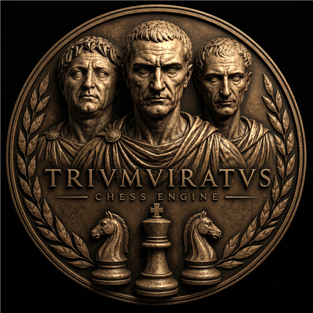

# Triumviratus

**A strong UCI chess engine in C++** — NNUE evaluation · SPSA-tuned alpha-beta search · Syzygy tablebases

**by Francesco Torsello**

in collaboration with Maurizio Platino

---

[Rating](#rating) · [8.0 (in development)](#triumviratus-80--in-development) · [7.0 (current release)](#triumviratus-70--current-release) · [6.0 (previous release)](#triumviratus-60--previous-release) · [Dev log 8.0](DEVELOPMENT_8.0.md) · [Dev log 7.0](archive/DEVELOPMENT_7.0.md) · [Dev log 6.0](archive/DEVELOPMENT_6.0.md) · [Networks](NETWORKS.md) · [What is new](NOVELTIES.md) · [Future directions](FUTURE_DIRECTIONS.md) · [Tests](tests/) · [History](HISTORY.md) · [License](#license) · [Credits](#credits)

---

## Rating

**CCRL Blitz** (2 min + 1 s):

| Version | Rating | Rank | List |
|---|---|---|---|
| **Triumviratus 7.0 64-bit (1 CPU)** | **3757** ±19 | **8** | 2026-09-26 |
| Triumviratus 6.0 64-bit (1 CPU) | 3749 ±13 | 12–14 | 2026-08-16 |
| Triumviratus 4.2 64-bit (1 CPU) | 3670 ±13 | 51–52 | 2026-08-08 |

**CCRL 40/15** (40 moves in 15 minutes + increment):

| Version | Rating | Rank | Games | List |
|---|---|---|---:|---|
| **Triumviratus 6.0 64-bit (4 CPU)** | **3632** ±17 | **13–14** | 678 | 2026-09-23 |
| Triumviratus 5.1 64-bit (1 CPU) | 3605 | — | — | 2026-07-23 |
| Triumviratus 5.0 64-bit (4 CPU) | 3603 | — | — | 2026-07-16 |
| Triumviratus 5.0 64-bit (1 CPU) | 3570 | — | — | 2026-07-16 |

Ranks are tie bands shared by the engines inside the interval: read the rating, not the rank. On
40/15, 6.0 sits 18 Elo behind the first entry (Stockfish 19 4 CPU, 3650 ±19). On Blitz, 7.0 (750 games
so far) is eighth among the best version of every engine, single- and multi-CPU mixed, ahead of
several 8-CPU entries; it has not appeared on 40/15 yet. The two lists are not comparable with each
other.

---

## Triumviratus 8.0 — in development

| step | result |
|---|---:|
| speed: faster code, identical search tree, new transposition table | +14.7 ± 5.4 against 7.0 |
| **Consilium**, the new network, with its parameters re-tuned | **+27.3 ± 8.3** against 7.0 |
| **restructured search**, re-tuned on our network | **+85.8 ± 12.8** against the previous 8.0 |
| **pre-release of 10 October**: move ordering with chess knowledge tuned by SPSA, the causal reduction (the author's idea) | **+11.9 ± 7.2** against the 9 October pre-release |

**Consilium** is, to our knowledge, the first mixture-of-experts network released in a top engine and the first shown
to gain strength: four experts on the network's largest block, one per phase of the game, at almost the cost of one
(an idea of the author's own, from language models: [`NETWORKS.md`](NETWORKS.md#the-idea-a-mixture-of-experts-on-the-king-relative-block)).
Since then: about 9% more speed with an identical tree, and our own ideas tested one at a time. The first six
adopted (a hash-move extension at low depth, a guard on it, more time after an unexpected reply, depth 0 for
quiescence hash entries, pins in the exchange evaluation, per-expert corrections) measured +4.5, +6.3, +6.2, +3.4,
+4.5 and +3.2 Elo ([dev log](DEVELOPMENT_8.0.md#the-path-so-far)). 8.0 is also the
first version to support **Chess960**.

**Head to head** (pre-release of 7–8 October, 1 thread, UHO 2024 book, each opening with both colours):

| opponent | TC | games | Elo |
|---|---|---:|---:|
| Stockfish 18 | 20+0.2 | 600 | **+24.9 ± 13.7** |
| Reckless 0.10.0-dev | 40+0.4 | 526 | **+68 ± 14** |

**Outside tests** (summary in [`tests/`](tests/), games and crosstables in
**[Triumviratus-Testing](https://github.com/Tors3/Triumviratus-Testing)**): in Maurizio Platino's matches the
8 October prerelease is level with **Stockfish 19**, **−6.9 ± 9.6** Elo (+137 =20 −143 in 300 games, 1 min + 1 s,
3 threads); the 4 October prerelease scores **+94 ± 16** Elo against Stormphrax 8.0.0 and **+25.5 ± 14.6** against
Reckless 0.10.0-dev (300 games each, 1 thread), and on his ENET 2026 suite it solves **89 of 110**, the best
Triumviratus so far. On Mark Tang's IQ4 suite the prerelease solves
**145 of 183**, the highest among the engines tested (143 with the build of 8 October); in his matches against the
development version of Stockfish it scored +3 =17 −10 at 2 min + 1 s and +5 =15 −10 at 103 s + 1 s (30 games each).

Details: **[`DEVELOPMENT_8.0.md`](DEVELOPMENT_8.0.md)** · **[`NETWORKS.md`](NETWORKS.md)** · **[`NOVELTIES.md`](NOVELTIES.md)** · **[`FUTURE_DIRECTIONS.md`](FUTURE_DIRECTIONS.md)**. `source/` holds the 8.0
development code; the current 8.0 pre-release (10 October, one executable for every x86-64 CPU) is the tag
[`v8.0`](https://github.com/Tors3/Triumviratus/releases/tag/v8.0); the 7.0 release is the tag `v7.0`.

---

## Triumviratus 7.0 — current release

A network project: **`legio-septima`**, the first network the project trained from scratch with all its blocks
together (`TRANN2`: the SFNNv16 feature set plus our own **`PassedPawns`** block), on a large corpus re-labelled with
Leela's BT4. **+21.3 ± 6.7 Elo over 6.0** at 25+0.25 (3,000 games). On Stefan Pohl's
[EAS ratinglist](https://www.sp-cc.de/eas-ratinglist.htm), which scores playing style, 7.0 is the **fourth most
aggressive of 16 engines**.

Measurements, training and matches against other engines:
**[`archive/DEVELOPMENT_7.0.md`](archive/DEVELOPMENT_7.0.md)** · **[`NETWORKS.md`](NETWORKS.md)** · **[`tests/`](tests/)**.

---

## Triumviratus 6.0 — previous release

**+52.98 ± 12.25 Elo over 5.1** (40+0.4, 760 games, LOS 100%, SPRT `[0,5]` passed), and the version
still carrying the project's ratings on both CCRL lists. Three changes carry most of it: the `TRANN1`
network architecture, the `nn-rubicon-alea-v3` network trained for it, and TMv2 time management.
Full log: **[`archive/DEVELOPMENT_6.0.md`](archive/DEVELOPMENT_6.0.md)**.

---

## License

> [!IMPORTANT]
> **GPLv3** — see [`COPYING`](COPYING). The **NNUE inference code** is derived from **Stockfish** (the SFNNv16 evaluation machinery in `nnue/`, GPLv3), and has since been reworked for our own mixture-of-experts network, Consilium (see [Credits](#credits)). Triumviratus' search was restructured in October 2026. Nearly all of its structures were already in the engine, but disordered and clogged by parameters and tests accumulated one at a time since version 5.0. After studying the searches of Stockfish and Reckless, it was reorganised following the structure of Stockfish 19's search (GPLv3), keeping our own ideas, with a complete SPSA re-tune on the new MoE network. It is Triumviratus' own code, with techniques of our own such as passed-pawn pushes in endgames, and our own data structures, move generation, evaluation and network. Of the two extra NNUE input blocks: **`PassedPawns` is an original feature of this project**, whereas **`PawnPair` implements a pawn-pair input feature that is shared across several open-source engines** (Stormphrax, Viridithas, Pawnocchio — see [Credits](#credits)); its C++ implementation and its trained weights are the project's own, but the feature *design* is not. The shipped network was trained by the project (see [`NETWORKS.md`](NETWORKS.md)). Because the engine incorporates Stockfish's GPL code, **the whole project is distributed under GPLv3**, with Stockfish's copyright notices preserved.

## Credits

### Testing & tuning

**Maurizio Platino** is the project's tester and search-tuner throughout its development. Beyond the
SPSA search-parameter tuning, he probes the engine's real playing strength by running it against
curated **hard positions at long time controls** — the kind of qualitative strength testing that fast
automated match-play cannot reach, and the project's only systematic testing of that sort — and has
generously contributed his hardware for the long tuning and testing runs. He also shares with the
author the cost of the cloud GPUs on which the project's networks are trained, Consilium included.
Triumviratus would be materially weaker without his work.

**Mark Tang** has tested the 8.0 prerelease against other engines and on the IQ4 tactical suite (results
in [`tests/`](tests/)). His remark that Stoofvlees answers very quickly between two moves, even at long time
controls, started the train of thought that led the author to the "surprise" rule of 8.0's time management: more
time on a move when the opponent did not play the reply the engine expected.

### Derived code

- **[Stockfish](https://github.com/official-stockfish/Stockfish)** (GPLv3) — the NNUE inference machinery in `nnue/` (accumulator stack, feature transformer, layers, threat and HalfKA features), ported from SFNNv16. Since then it has been extensively modified, tested and extended to fit Triumviratus' own networks: its own input blocks (PassedPawns, PawnPair), the four phase experts of the Consilium network, row permutation for cache locality, refresh caches for the pawn blocks and for phase changes, and many measured speed changes.
- **[BBC](https://github.com/maksimKorzh/chess_programming)** by Maksim Korzh ("Code Monkey King") — the original bitboard/magic-number move generator; the project's earliest (2024) foundation for `attacks.cpp`/`magic.cpp`/`movegen.cpp` and the first search, both since substantially rewritten and extended.
- **[Fathom](https://github.com/jdart1/Fathom)** (MIT) — Syzygy tablebase probing.

### Open-source engines studied

Ideas for search, move-ordering, time management and pruning were studied from — and in several cases
ported and then **re-tuned against the project's own data and network** — a number of open-source
engines. Credit and thanks to all of them:

- **[Stockfish](https://github.com/official-stockfish/Stockfish)** — the October 2026 restructuring of the search follows the structure of Stockfish 19's search (see [`DEVELOPMENT_8.0.md`](DEVELOPMENT_8.0.md), section 17).
- **[Reckless](https://github.com/codedeliveryservice/Reckless)** — quiet move-ordering (offense-square and king-shield-pawn terms), TT prefetch, capture-ordering ideas.
- **[Caissa](https://github.com/Witek902/Caissa)** — node-count move cache, quiescence capture history, moves-left time curve.
- **[Alexandria](https://github.com/PGG106/Alexandria)** — the multiplicative, stateless time-management factors.
- **[Pawnocchio](https://github.com/JonathanHallstrom/pawnocchio)**, **[Viridithas](https://github.com/cosmobobak/viridithas)** — the **`PawnPair` NNUE input feature** (see below).
- **[Berserk](https://github.com/jhonnold/berserk)**, **[Obsidian](https://github.com/gab8192/Obsidian)**, **[Ethereal](https://github.com/AndyGrant/Ethereal)** and **[Stormphrax](https://github.com/Ciekce/Stormphrax)** — assorted search, pruning and ordering refinements.

**NNUE input features — attribution.** The **`PawnPair`** block (pairs of pawns on the same or adjacent files, `4560` inputs) is **not an original idea of this project**. It was **invented by Jonathan Hallström for [Pawnocchio](https://github.com/JonathanHallstrom/pawnocchio)**, from his observation that in a network trained on *all* pawn pairs the ones that mattered were those at most one file apart. It was also used by **Stormphrax** and **Viridithas**, and in July 2026 **Stockfish adopted it too, as `PP_3Wide`**. Our C++ implementation (`nnue/features/pawn_pair.*`) and the trained weights are our own; the idea is his.

The **`PassedPawns`** block (one input per passed pawn, 96 slots) is, by contrast, **an original feature of this project** — designed, implemented and trained here, and present in no other engine we know of.

The open-source computer-chess community is what makes a project like this possible.

Developed openly and with significant AI assistance.